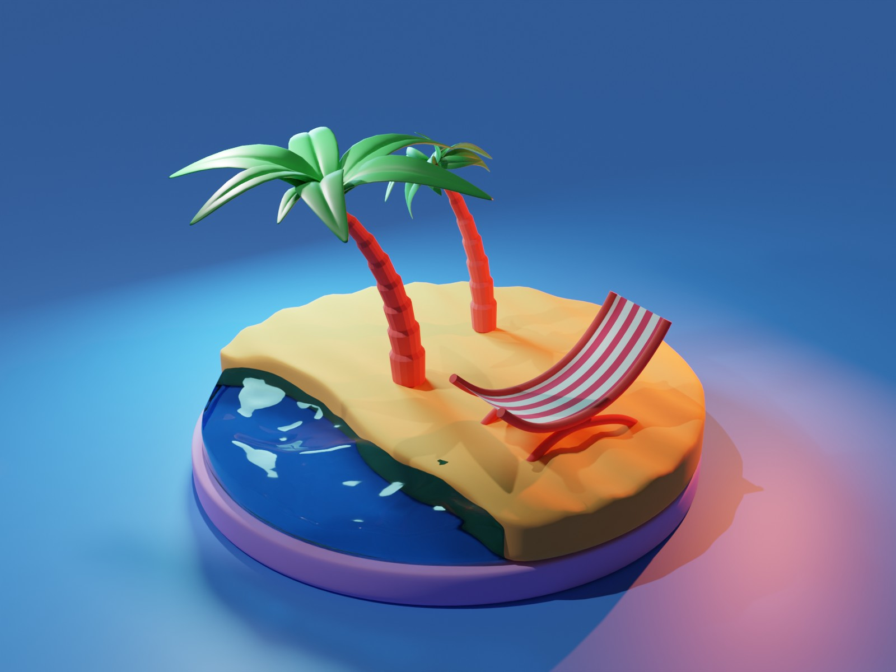

# Summer Island

Summer Island is a 3d-animation created in Blender within Computer Graphics Course, Kyiv Polytechnic University, October 2022.

## Usage
The project file could be reviewed in Blender by simply opening summer-island.blend in the application.

## Result

To see the animation click on the image to navigate to YouTube.

## License
[MIT](https://choosealicense.com/licenses/mit/)
