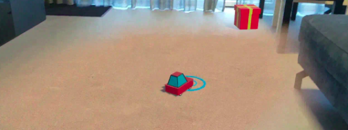

# Computer Graphics
The project contains a collection of computer grapics works created in Blender within Computer Graphics Course, Kyiv Polytechnic University.

## 1. Summer Island
Summer Island is a 3d-animation created in Blender.

### Usage
The project file could be reviewed in Blender by simply opening summer-island.blend in the application.

### Result
[](https://youtu.be/Bnm0-Iak6kk "CG Summer Island Sofiia Chorna")

To see the animation click on the image to navigate to YouTube.


## 2. AR Car Drive
A simple game using AR Foundation. The goal of the game is to collect packages using a car that user controls using a handheld device. In the game it is possible to:
* Detect real-world planes and draw a playing field over it.
* Cast rays from the camera's view and detect intersections with planes.
* React to real-world lighting conditions.

### Technologies used: 
```
* Unity
* ARCore
* C#
```

### Result
[](https://youtube.com/shorts/gdrpA1k8us8 "AR Car Drive - Sofiia Chorna")

To see the animation click on the image to navigate to YouTube.

### Installation
ARCarDrive.apk could be installed as a mobile application. Double-click on the .apk file and follow the instructions.

## License
[MIT](https://choosealicense.com/licenses/mit/)
